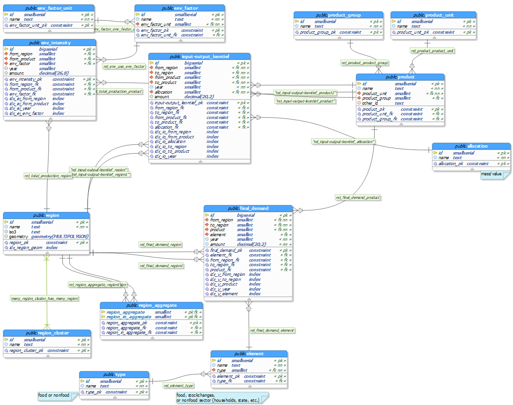

# IO Visualization
A set of tools that allow for interactive visualization of input-output tables.

The purpose of this project is to provide an interactive web visualization for input-output tables using R and PostgreSQL. As of right now there are two components, an R Shiny web application and a PostgreSQL Database (more specifically a PostGIS one). The network of those two components can be created with one single `docker-compose` command.

## Usage
1. [Dependencies](#dependencies)
2. [Get the app](#get-the-app)
3. [Setup](#setup)
4. [How to run](#how-to-run)
5. [How to restart/stop](#how-to-restart-or-stop-the-app)

### Dependencies
In order to run the app, you need the following tools installed:

#### Docker and Docker Compose
To install Docker and Docker Compose (comes already installed with Docker Desktop) for you system follow the links below:

- Mac: [Install Docker Desktop for Mac](https://docs.docker.com/docker-for-mac/install/) to get Docker and Docker Compose installed
- Windows: [Install Docker Desktop for Windows](https://docs.docker.com/docker-for-windows/install/) to get Docker and Docker Compose installed
- Ubuntu:
    - [Docker](https://docs.docker.com/install/linux/docker-ce/ubuntu/)
    - [Docker Compose](https://docs.docker.com/compose/install/)
- Other systems:
    - [Docker](https://docs.docker.com/install/)
    - [Docker Compose](https://docs.docker.com/compose/install/)

#### (git)
You only need git installed if you want to contribute to the repository or clone it without having to download it manually.

#### (R and RStudio)
You only need R (version 3.5 or higher) and RStudio installed in case you would like to make your own changes to the app and try them out before you create the docker containers.

If you are on a Linux machine, you need to install the following packages via `apt` (or any other package manager) as they are required by the R packages needed:
`sudo apt install libpq-dev libssl-dev libxml2-dev libcurl4-openssl-dev`

The command to install the R packages can be found on the respective file you want to edit.

### Get the app
To get the app, you can either

- download the source using the "Clone or download"-button above
- use `git clone https://github.com/fineprint-global/io-visualization.git`

### Setup
There are a few settings that you have to make before you can run the app.

#### `.env` file in the root directory
You have to set the following variables, here is an example `.env` file:

```
POSTGRES_PASSWORD=postgresuserpassword
POSTGRES_PORT=5454
SHINY_PORT=80
```

#### `.Renviron` file in the `/app` directory
In the `.Renviron` file, you need to set the internal container port (which is the `5432`) as your `db_port`, so **DO NOT** match the `POSTGRES_PORT` you set in the `.env` file, but set the **default port for postgres**, which is `5432`. Here is an example file that needs to be created inside the `/app` directory. Only if you would run the app in a separate docker-network then you would need to use the `POSTGRES_PORT` you set.

```
db_host=ioviz_db
db_port=5432
db_name=fabio
db_user=app
db_password=appuserpassword
```

### How to run
There are three ways to run this app.

1. You can run it as is, with FABIO pre-loaded into the database.
2. You can use your own input-output table, which requires you to adapt the scripts in the [input-output-to-db](db/input-output-to-db) directory.
3. You can leave the database as is and change the visualizations in the [app](app/) directory.

#### 1. Run as is

1. Make sure all necessary dependencies are installed.
2. Make sure Docker (Desktop) is up and running.
3. Make sure you completed the steps in [setup](#setup).
4. Make sure you get all necessary files from [FABIO via [Zenodo](https://dx.doi.org/10.5281/zenodo.2577067) and run the scripts in the [input-output-to-db](db/input-output-to-db) directory.
5. Navigate to the root directory (`io-visualization`) with a shell of your choice and run the following command:
`docker-compose up -d`

Now both, the `ioviz_app` (RShiny app) and the `ioviz_db` (PostGIS database) should be running on ports specified in the `docker-compose.yml` on your localhost (e.g. ports `80` and `5454` respectively, although `ioviz_app` will communicate with `ioviz_db` at port `5432` in their internal docker-network). To verify that both containers are running and the ports are correct, you can run `docker-compose ps` (in the root directory) or `docker ps` (anywhere).

You should now be able to see the app running at [localhost:80](localhost:80) or – if not `80` – at the port you specified in `SHINY_PORT`.

If there are any problems, check out the [troubleshooting](#troubleshooting) section.

#### 2. Use your own input-output table
You will have to adjust the `main.R` located in the [input-output-to-db](db/input-output-to-db/) directory to load your own input-output table and adjust it to the proper database format.

##### 2.1 Database format
In order for your input-output table to be used with the Shiny app, you first need to adjust it to the database format used for this application.

The database format can be found in the [db](db/) folder in both `.dbm` format (to be viewed and edited via the open source data modelling software [pgModeler](https://pgmodeler.io/)) and [`.png` format](db/io-visualization_model.png).



Please care, the `input-output` table in the database is the **Leontief Inverse** of the input-output table.

Check out the `main.R` file to see how `FABIO` was modified from big matrices in `.rds` files to fit the database format.

#### 3. Change the visualizations
The folders to take care of are the [app](app/) folder and the [docker-rshiny](docker-rshiny/) folder. The `app` folder will be used to change the visualizations whereas the `docker-rshiny` folder needs to be kept in mind for any new packages you might require.

##### 3.1 `app` folder
Before you dive into this, if you are new to RShiny, you may want to check out this [tutorial](https://shiny.rstudio.com/tutorial/).

In our example, the `app` folder is divided into 4 main files:

- `app.R`: you should not need to add anything there, this just brings all three other files together
- `global.R`: this will be executed *once* for every worker process, not for every user, so this is where you specify database connections and perform other setup-related tasks
- `ui.R`: you specify the user interface here. `output` elements (e.g. `plotlyOutput()`) are defined here and respective `render` functions (e.g. `renderPlotly({ ... })`) for those are performed in the `server.R`. If you want to add new visualizations or other elements, define them here.
- `server.R`: any new visualizations defined in the `ui.R` should be implemented in the `server.R`, this is where you collect your data, bring it into the correct format and then define the output (e.g. for `plotly`).

##### 3.2 `docker-rshiny` folder for packages
You need to edit the [Dockerfile](docker-rshiny/Dockerfile) if you add any new packages that are not included yet.

As an example, in this part of the Dockerfile …
```Dockerfile
...
# Install a few dependencies for packages
RUN apt-get update \
  && apt-get install -y --no-install-recommends \
  && install2.r --error \
    plotly \
    RPostgreSQL \
    pool \
    RColorBrewer \
    shinythemes \
    shinycssloaders \
    viridis
...
```
... you could edit it to include `leaflet` to add map functionalities:
```Dockerfile
    ...
    viridis \
    leaflet
...
```

### How to restart or stop the app
- To restart the containers, move to the `io-visualization` directory and run `docker-compose restart`
- To stop the containers, run `docker-compose stop`
- To stop containers and to remove containers, networks, volumes, and images created by `docker-compose up`, run `docker-compose down`

## Troubleshooting

- Make sure you have all dependencies (packages etc.) installed, you may want to check out the Dockerfile in `docker-rshiny/` for any packages necessary for the app to run.

### Windows-Issues with RShiny Docker
In case there are issues with building and running the R Shiny Docker from the directory (especially in Windows, file permissions tend to get messed up, and then the container is constantly restarting, sometimes with the error: `standard_init_linux.go:207: exec user process caused "no such file or directory"`), you can alternatively use the docker image from Docker Hub. For this, you need to replace the build context with the Docker Hub image like below:
```YAML
    # build:
    #   context: ./docker-rshiny
    image: fineprint/ioviz-rshiny
```

## Acknowledgement
This project has received funding from the European Research Council (ERC) under the European Union's Horizon 2020 research and innovation programme (grant agreement No. 725525).
